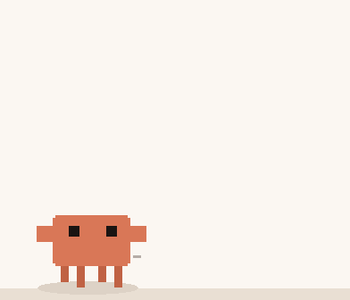
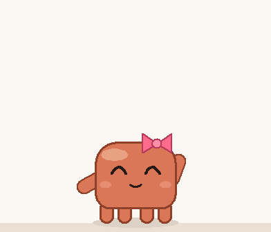

# claude-pet 🦀

> **Unofficial fan project.** Clawd is Anthropic's mascot. This project is not affiliated with, endorsed by,
> or sponsored by Anthropic. It is a free, non-commercial tribute for personal use.

<p align="center">
  
  
</p>

A desktop pet for Claude Code: **Clawd** wanders along the bottom of your screen and reacts to what Claude is
doing: typing while Claude works, celebrating when it finishes, and waving at you when Claude needs your approval.

Supports **English** and **繁體中文** (auto-detected, switchable any time).

**Works everywhere you use Claude Code:**

| Where you run Claude Code | Supported |
| --- | --- |
| Claude desktop app (Code tab) | ✅ |
| Claude Code CLI in a terminal (Windows Terminal, PowerShell, cmd…) | ✅ |
| Claude Code CLI inside an editor (VS Code, Cursor, JetBrains IDEs…) | ✅ |

## Install

### 1. Prerequisites (Windows only)

| You need | Check | Install if missing |
| --- | --- | --- |
| Windows 10 / 11 | | macOS and Linux aren't supported yet |
| Node.js | `node --version` | `winget install OpenJS.NodeJS.LTS` |
| Python 3 with tkinter | `python -c "import tkinter"` | `winget install Python.Python.3.13` |

The Python installer from python.org or winget includes tkinter. If you install from python.org, keep
"tcl/tk and IDLE" ticked. Restart your terminal after installing so the new commands are found.

### 2. Add the plugin

In a Claude Code session, run:

```
/plugin marketplace add Door3172/clawd-desktop-pet
/plugin install claude-pet@pet-marketplace
```

Plugins are installed per user, so this also enables the pet in the Claude desktop app.

### 3. Restart Claude Code

Clawd drops in from the top of the screen when a new session starts. By default it only shows while Claude is
in front, so switch back to Claude if you don't see it.

Nothing showing up? Run `/claude-pet:pet doctor` (see [Troubleshooting](#troubleshooting)).

## Two skins (right-click → Skin)

- **Pixel Clawd** (default): sprite-sheet art that looks closest to the original. It also drinks coffee and
  water, eats fries, holds a flower, plays games, reads, and sleeps in a nightcap.
- **Chibi Clawd**: a round, hand-drawn version that squashes and stretches, tumbles when thrown, and comes in
  four colors.

Both skins can wear **accessories**: party hat, bow, sprout, and a crown (unlocks at Lv.10).

## Reacting to Claude

| Event | Reaction |
| --- | --- |
| Claude is working | Types on a laptop (or reads a book while reading, searching or browsing), with a caption showing what it's doing and for how long, e.g. "Searching 1:24" |
| Claude finishes | Jumps and throws confetti. Long replies show "Done! Took 2:13", and very long ones get a dance |
| Claude needs permission | Waves and shouts "Needs your OK!" (plain "waiting for input" notices are ignored) |
| Level up / achievement | Spins with sparkles and announces it |
| Session ends | Waves goodbye |

**Pop-up reminders:** when Claude finishes, needs you, or a pomodoro ends while you're in another app, Clawd
pops up for a moment (with an optional sound). **Click it to jump straight back to Claude.** Clicking the pet
also hands focus back to the window you were in, so it never interrupts your typing.

## Fun stuff

- **Throw it**: drag and fling. It tumbles, bounces off the screen edges, and gets dizzy on hard landings.
- **Ball**: right-click → Bring out the ball. Throw it around and Clawd chases and kicks it.
- **Poke it**: 4 quick clicks make it jump; 7 make it angry (hidden achievement!).
- **Tricks**: right-click → Tricks (dance, spin, jump, wave, stretch, sleep), or `/pet trick dance`.
- **Make it talk**: `/pet say hello`.
- **Chatter**: now and then it comments on the time of day, today's stats, or your streak.
- **Achievements**: 20 of them (2 hidden). Right-click → Achievements & stats.

## Quality of life

- **Pomodoro timer** with a countdown above its head (25 / 50 / 5 min or custom).
- **Break reminder**: after 60 minutes of continuous computer use (resets after 5 idle minutes).
  Choose 30 / 45 / 60 / 90 minutes or turn it off.
- **Do not disturb**: no pop-ups, sounds, chatter or break reminders.
- **Stay put**: stops it from wandering around.
- **Hide for a while**: 10 / 30 / 60 minutes (handy when screen sharing).
- **Hover** over it to see its name, level, food and mood.
- **Ctrl + mouse wheel** over it to resize.
- By default it only shows while Claude is in front: the Claude desktop app, or a terminal / editor running the
  Claude Code CLI (Windows Terminal, PowerShell, VS Code, Cursor, JetBrains IDEs...). Toggle it in Settings.

## Commands

| Command | Description |
| --- | --- |
| `/claude-pet:pet` | Status |
| `/claude-pet:pet help` | All commands |
| `/claude-pet:pet stats` / `achievements` | Stats / achievements |
| `/claude-pet:pet feed` / `play` | Feed / play |
| `/claude-pet:pet trick dance` | Tricks: dance / spin / jump / wave / stretch / sleep |
| `/claude-pet:pet say <text>` | Make it say something |
| `/claude-pet:pet timer 25 <label>` / `timer off` | Pomodoro timer |
| `/claude-pet:pet hat party` | Accessory: none / party / bow / sprout / crown |
| `/claude-pet:pet name <name>` | Rename |
| `/claude-pet:pet skin pixel` / `chibi` | Switch skin |
| `/claude-pet:pet color blue` | Chibi color: orange / blue / green / purple |
| `/claude-pet:pet lang en` / `zh-TW` / `auto` | Language |
| `/claude-pet:pet show` / `hide` | Bring out / put away the pet |
| `/claude-pet:pet settings` | Show all settings |
| `/claude-pet:pet doctor` | Check the setup when the pet doesn't appear |
| `/claude-pet:pet peek off` | Other switches: focus / peek / sound / chatter / stay / follow / dnd (on/off) |
| `/claude-pet:pet break 45` / `break off` | Break reminder interval |
| `/claude-pet:pet autostart off` | Don't bring out the pet when Claude Code starts |

## Troubleshooting

Run **`/claude-pet:pet doctor`** first. It checks your OS, Node.js, Python and tkinter, whether the pet is
running, and shows recent errors, each with a suggested fix.

| Problem | Fix |
| --- | --- |
| Clawd never appears | By default it only shows while Claude is in front. Try `/claude-pet:pet show`, or `/claude-pet:pet focus off` to keep it on screen. |
| "Python 3 was not found" | Install Python (see above) and restart Claude Code. The Microsoft Store `python.exe` shortcut that ships with Windows is not a real Python. |
| `/claude-pet:pet` fails with "node is not recognized" | Install Node.js (see above), then restart Claude Code. |
| It stopped reacting to Claude | Restart Claude Code after installing or updating the plugin so the hooks reload. |
| Something else | Check `~/.claude/pet/desktop.log` and open an issue with its contents. |

## Update & uninstall

Update:

```
/plugin marketplace update pet-marketplace
/plugin update claude-pet@pet-marketplace
```

Uninstall:

```
/claude-pet:pet hide
/plugin uninstall claude-pet@pet-marketplace
/plugin marketplace remove pet-marketplace
```

Your pet's save data stays in `~/.claude/pet/`. Delete that folder to remove it too.

## Files

- `claude-pet/scripts/pet_window.py`: the desktop window (skins, animations, interaction, ball, timer, reminders)
- `claude-pet/scripts/pet.js`: command and hook entry point; updates state and stats
- `claude-pet/scripts/lang.json`: UI strings for every language
- `claude-pet/scripts/achievements.json`: achievement definitions
- `claude-pet/assets/clawd-sprites.png`: pixel sprites (third party, MIT, see `NOTICE`)
- Your pet's state is stored locally in `~/.claude/pet/` (`state.json`, `prefs.json`, `desktop.log`)

### Adding a language

Copy the `"en"` block in `lang.json` to a new language code, translate the values, and add the same code to
the `name` / `desc` objects in `achievements.json`. It will show up in the Language menu and in `/pet lang`.

## Development

```
python claude-pet/scripts/pet_window.py --gallery                      # preview every chibi pose
GALLERY_SKIN=pixel python claude-pet/scripts/pet_window.py --gallery   # preview the pixel skin
GALLERY_LANG=zh-TW python claude-pet/scripts/pet_window.py --gallery   # preview in another language
python claude-pet/scripts/pet_window.py --force dance                  # start and force an animation
```

Set `CLAUDE_PET_DIR` to use a separate state folder while testing.

Regenerate the README GIFs and the social preview image with `python tools/make_media.py` (needs Pillow).

## Credits & license

- Code: MIT, see [LICENSE](LICENSE).
- Pixel sprites: [shigure0110/clawd-pet](https://github.com/shigure0110/clawd-pet) (MIT), see
  `claude-pet/assets/LICENSE.clawd-pet`.
- Transparent-window technique inspired by [Mochi Desktop Pet](https://github.com/m18023318493-sys/mochi-desktop-pet) (MIT).
- Clawd and Claude are trademarks of Anthropic. This is an unofficial fan work. See `claude-pet/NOTICE`.
